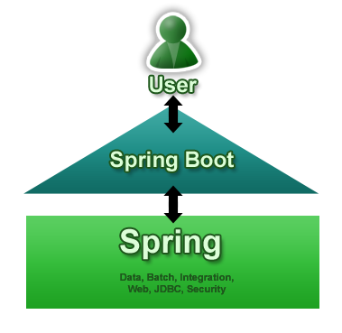
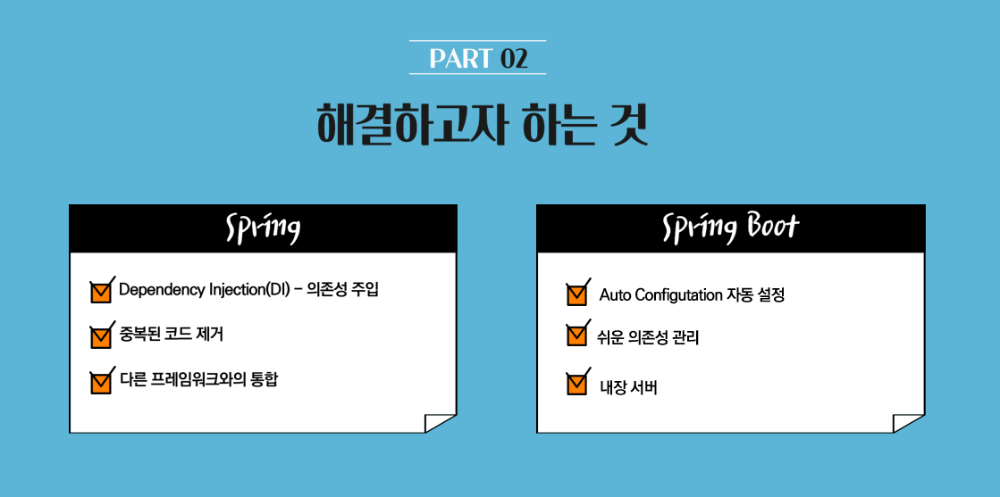

# Spring & Spring Boot

<br>

## Spring 이란?
### Spring 핵심 철학
- 스프링은 JAVA 기반의 FrameWork
- 객체지향 프로그래밍이 제공하는 폭넓은 혜택을 누릴 수 있도록, 기본으로 돌아가 오브젝트에 관심을 갖는것을 목표

### Spring 사용 이유
- 단순화된 단위 테스팅
- 복잡한 코드의 감소
- 아키텍처의 유연성

<br>
 
## Spring 구조
### Spring 주요 모듈 
- 레이어 별로 크게 `Core Container`,`AOP`,`Web`,`Data Acess`, `Test` 로 나눌 수 있다.


#### Core Container
스프링 Core Container 에는 4가지 모듈이 있다.
1. Bean & Core
   - `IoC / DI` 기능의 지원을 담당
   - `Core`는 다른 스프링 모듈에서 필요로 하는 공통 기능을 갖고있는 핵심 모듈. 주요 어노테이션, 컨버터, 상수, 유틸리티 클래스등을 제공.
   - `Beans`는 스프링 DI 기능 기능의 핵심인 Bean Factory와  DI 기능을 제공 하는 모듈
2. Context
   - Beans의 기능을 구현받아 사용하는 Beans의 확장 버전. 해당 모듈을 가장 많이 쓰며, Spring 개발의 필수.
3. spEL
   - 객체 그래프를 조회하고 조작하는 기능을 제공
   > 표현식 <BR>
   > '#{"표현식"}' : "표현식"을 실행함 <BR> <BR>
   > 프로퍼티 참조 <BR>
   > ${"프로퍼티"} : "프로퍼티"를 참조할 때 사용.

   
#### AOP
1. AOP
   - AOP를 구현하기 위한 메소드 인터셉터 및 포인트 컷을 정의
2. Aspect
3. Instrument
4. Test

#### WEB
#### Data Access
#### Test

<br>
<br>

## Spring 핵심 3요소
### IoC(Inversion of Control)
#### IoC란?
- IoC란 기존 사용자가 모든 작업을 제어하던 것을 컨테이너에게 위임하여 객체의 생성부터 생명주기 등 모든 객체에 대한 제어권이 넘어간 것을 IoC, 제어의 역전이라고 함. 
이런한 제어권을 위임받은 컨테이너가 `IoC 컨테이너`


- 일반적인 의존성에 대한 제어권 : 개발자가 직접 의존성을 만듬
- 의존성이란 어떤 객체가 다른 객체를 사용하여 두 객체간의 연결을 의미함. 직접 new를 써서 객체를 생성하는 경우를 직접 의존성을 만든다고 함.
```java
public class OwnerController {
private OwnerRepository ownerRepository = new OwnerRepository();  //변수 선언과 객체 생성을 본인이 함
}
```
---
- 제어권 역전 : 직접 의존성을 만들지 않고 외부에서 의존성을 가져옴. 
- 즉, 밖에서 나에게 의존성을 주입해 주는 것을 DI(Dependency Injection)이라고 함.
```java
class OwnerController {

    private OwnerRepository repo;  //변수 선언만 함

    public OwnerController(OwnerRepository repo) {  //외부에서 객체를 주입받음
    this.repo = repo;
}

```
### AOP
#### AOP(Aspect-Oriented Programming) 란?
- 관점 지향 프로그래밍의 줄임말로, OOP로 독립적으로 분리하기 어려운 부가기능을 모듈화 하는 방식. 
분리한 부가기능을 `Aspect` 라는 모듈 형태로 만들어서 설계하고 개발하는 방법임.
- 핵심 기능에서 부가기능을 분리함으로써 핵심기능을 설계하고 구현할 때 객체지향적인 가치를 지킬 수 있도록 도와주는 개념.

#### Aspect 란?
- 부가기능을 정의한 코드인 `Advice`와 Advice를 어디에 적용할지를 결정하는 `PointCut`을 합친 개념
 
#### AOP 용어 정리
- 타겟(Target)
  - 핵심 기능을 담고 있는 모듈로 타겟은 부가기능을 부여할 대상(객체)이 된다.
- 어드바이스(Advice)
      - 어드바이스는 타겟에 제공할 부가기능을 담고 있는 모듈이다.
- 조인포인트(Join Point)
      - 어드바이스가 적용될 수 있는 위치를 말한다. 타겟 객체가 구현한 인터페이스의 모든 메서드는 조인 포인트가 된다.
- 포인트 컷(Pointcut)
      - 어드바이스를 적용할 타겟의 메서드를 선별하는 정규표현식이다. 포인트컷 표현식은 execution으로 시작하고 메서드의 Signature를 비교하는 방법을 주로 이용한다.
- 애스펙트(Aspect)
      - AOP의 기본 모듈. 부가기능을 정의한 코드인 `Advice`와 Advice를 어디에 적용할지를 결정하는 `PointCut`을 합친 개념.
      - 싱글톤 형태의 객체로 존재한다.
- 어드바이저(Advisor)
        - `Aspect`와 같은 기능. 

#### 구현 방법


### PSA

<br>
<br>

## DI를 이용한 객체 생성
- DI란?
- 의존성 주입 방법

<br>
<br>

## Bean 라이프 사이클과 범위


## Spring Boot
### Spring Boot란?

- 

### Spring 과 Spring Boot의 차이점
 

 - Embed Tomcat을 사용하여 따로 Tomcat을 설치하거나 매번 버전을 관리해 주어야 하는 수고스러움을 덜어줌
 - DI 설정을 XML에서 할 필요가 없음


 