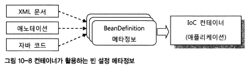
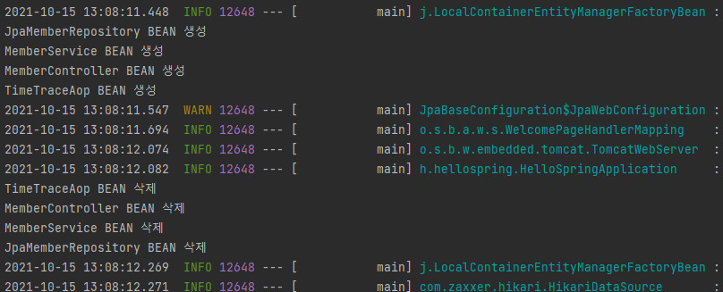
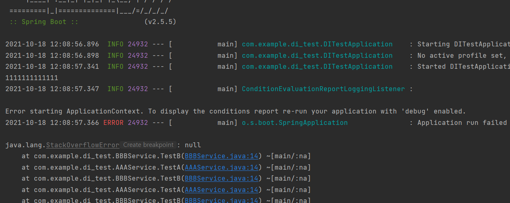
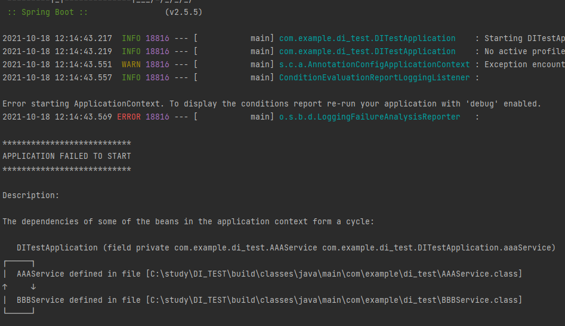
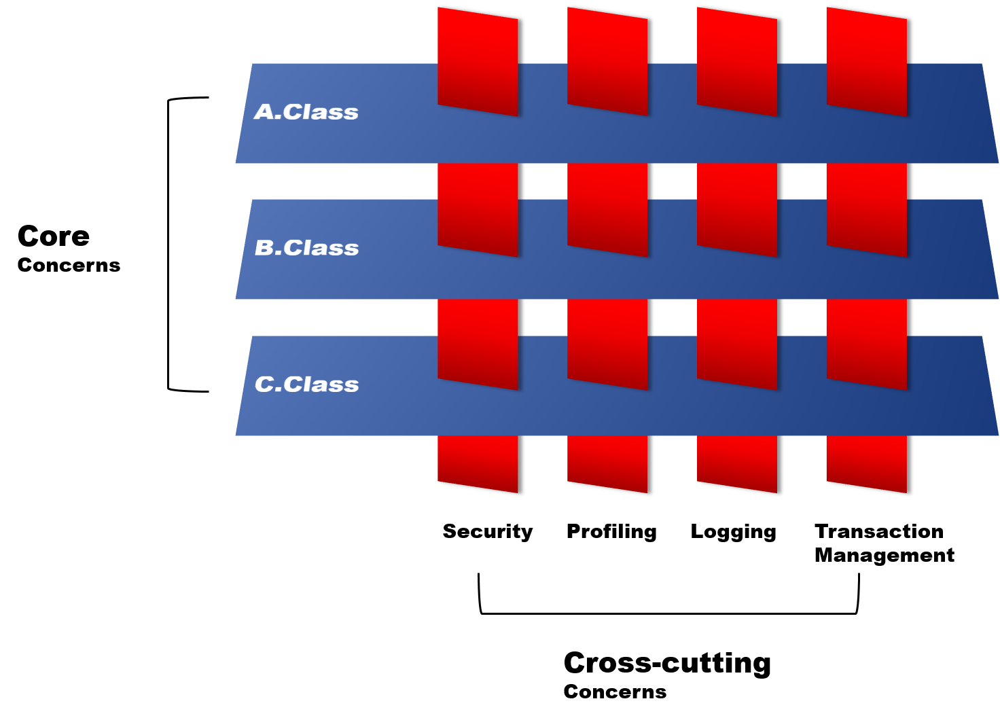
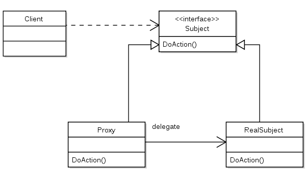
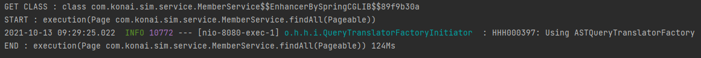

# Spring & Spring Boot

<br>

## Spring 
### Spring 이란?
- 소규모 어플리케이션 또는 기업용 어플리케이션을 자바로 개발하는데 있어 유용하고 편리한 기능을 제공하는 프레임워크

### Spring 사용 이유
- 단순화된 단위 테스팅
- 복잡한 코드의 감소
- 아키텍처의 유연성

<br>
 
## Spring 구조
### Spring 주요 모듈 
- 레이어 별로 크게 `Core Container`,`AOP`,`Web`,`Data Acess`, `Test` 로 나눌 수 있다.


#### Core Container
스프링 Core Container 에는 4가지 모듈이 있다.
1. Bean & Core
   - `IoC / DI` 기능의 지원을 담당
   - `Core`는 다른 스프링 모듈에서 필요로 하는 공통 기능을 갖고있는 핵심 모듈. 주요 어노테이션, 컨버터, 상수, 유틸리티 클래스등을 제공.
   - `Beans`는 스프링 DI 기능 기능의 핵심인 Bean Factory와  DI 기능을 제공 하는 모듈
2. Context
   - Beans의 기능을 구현받아 사용하는 Beans의 확장 버전. 해당 모듈을 가장 많이 쓰며, Spring 개발의 필수.
3. spEL
   - 객체 그래프를 조회하고 조작하는 기능을 제공
   > 표현식 <BR>
   > '#{"표현식"}' : "표현식"을 실행함 <BR> <BR>
   > 프로퍼티 참조 <BR>
   > ${"프로퍼티"} : "프로퍼티"를 참조할 때 사용.

   
#### AOP
1. AOP
   - AOP를 구현하기 위한 메소드 인터셉터 및 포인트 컷을 정의
2. Aspect
3. Instrument
4. Test

#### WEB
#### Data Access
#### Test

<br>
<br>

## Bean 라이프 사이클과 범위
### Bean이란?
- Spring IoC 컨테이너에 의해 관리되는 객체들을 `Bean`이라고 함. Bean은 Spring Ioc 컨테이너에 의해 인스턴스로 만들어지고, 조립되고, 관리를 받음.

<br>

### Bean 등록 방법

- 컨테이너는 빈 설정 메타정보를 파일이나 애노테이션같은 리소스로부터 전용 리더를 통 해 읽혀서 BeanDefinition 타입의 오브젝트로 변환.
- BeanDefinition 정보를 IoC 컨테이너가 활용하게 됨.

<br>

#### 1. xml 설정파일을 이용한 방법
appplication.xml 파일에 `<bean>`태그를 이용해 빈을 등록하는 방법이다. 
```xml
<bean id="aaa" class="xxx.yyy.zzz.AAA">
   <property name="prop"></property>
</bean>
```
- Bean의 성격을 구분하기 어려움
- Bean의 양이 늘어나면 관리하기 어려움
- 여러 개발자가 같은 설정파일을 수정하면 충돌 위험이 일어날 수 있음

<br>

#### 2. Annotation을 이용한 자동인식
빈으로 사용될 클래스에 특별한 애노테이션을 부여하여 자동으로 빈으로 등록해주는 방법. 
 
|Bean 등록 어노테이션|설명 |
|-----|------|
|@Component|개발자가 직접 작성한 Class를 Bean으로 등록하기 위한 어노테이션. Class의 이름을 camelCase로 변경한것이 Bean ID로 사용됨. | 
|@Repository| DAO class에 쓰임. DataBase에 접근하는 method를 가지고 있는 Class에서 쓰임. | 
|@Service|Service Class에서 쓰인다. 비즈니스 로직을 수행하는 Class라는 것을 나타냄| 
|@Controller|Controller임을 의미.| 
|@RestController|View로 응답하지 않는 Controller임을 의미.     결과를 JSON 형태로 반환| 

- 스프링의 빈 스캐너는 @Component 애노테이션 또는, @Component를 메타 애노테이션으로 가진 애노테이션이 부여된 클래스를 선택하여 빈으로 등록. 이러한 애노테이션을 <span style="color:red">스테레오타입 애노테이션</span> 이라고 함.
- xml 방식에 비해 빈 등록이 간단함. 개발 속도 향상.
- 등록 대상이 되는 bean을 한눈에 확인하기 어려움. 
- xml처럼 상세한 메타정보 항목을 지정할 수 없고, 클래스당 한개 이상의 빈을 등록 할 수 없음.

<br>

#### 3. Java Code에 의한 등록
@Configuration 어노테이션이 부여되어있는 클래스에 @Bean 어노테이션을 사용하여 빈을 등록하는 방법

```java
@Configuration
public class ExampleConfiguration {
    
    @Bean
    public ExampleController exampleController() { //메소드 이름이 등록되는 빈의 이름이 됨
        
        return new ExampleController; //리턴되는 객체가 빈으로 활용됨
    }
    
}
```
- return 되는 객체가 Ioc 컨테이너 안에 빈으로 등록된다.
- 메소드 이름이 빈의 이름이 된다.
- @Configuration의 메타 어노테이션 안에 @Component가 포함되어있기때문에 설정이 담긴 자바 클래스도 빈으로 등록됨 

    
| @Bean | @Component|
|-------|-----------|
| 메소드 레벨에 등록| 클래스 레벨에 사용|
|개발자 컨트롤이 불가능한 외부 라이브러리 사용시| 개발자가 직접 컨트롤이 가능한 내부 클래스에 사용|


<br>

### Spring Container의 초기화와 종료
#### 스프링 컨테이너란?
자바객체(Bean)의 생명주기를 관리하며, 생성된 자바객체들에게 추가적인 기능을 제공하는 역할을 함. 
<br>

#### 스프링 컨테이너 종류
`BeanFactory` 와 이를 상속한 `ApplicationContext` 가 있음

##### BeanFactory 
Bean 객체를 생성하고 관리하는 기본적인 기능을 제공.  

<br>

##### ApplicationContext
BeanFactory를 상속받아 기능을 확장.

<br>

#### Spring Container 라이프 사이클
1. 스프링 컨테이너 생성.
2. Bean 등록.
   1. @Configuration의 @Bean 어노테이션을 이용한 수동 등록.
   2. @ComponentScan을 이용한 자동 등록.
3. Bean들이 모두 등록되면 Bean들의 의존 관계 주입(DI).
4. 의존관계 주입이 끝나면 스프링은 콜백을 주고, 빈들을 초기화 함.
5. 셋팅된 빈으로 Application을 실행.
6. 스프링 컨테이너는 종료되기전 소멸 콜백을 줌.
7. 스프링 컨테이너 정지

<br>

#### 라이프 사이클 예제
* HelloSpringApplication.java

```java
@SpringBootApplication
public class HelloSpringApplication {

	public static void main(String[] args) {
		//SpringApplication.run(HelloSpringApplication.class, args);

		ConfigurableApplicationContext ctx =  SpringApplication.run(HelloSpringApplication.class, args);

		ctx.close();

	}
}
```

<br>

* MemberController.java

```java
@Controller
public class MemberController {

    @PostConstruct
    public void init() {
        System.out.println("MemberController BEAN 생성");
    }

    @PreDestroy
    public void stop(){
        System.out.println("MemberController BEAN 삭제");
    }
    
    private final MemberService memberService;
 
    public MemberController(MemberService memberService){
        this.memberService = memberService;
    }
```
<br>

* MemberService.java

```java
@Service
@Transactional
public class MemberService {
    
    @PostConstruct
    public void init() {
        System.out.println("MemberService BEAN 생성");
    }

    @PreDestroy
    public void stop(){
        System.out.println("MemberService BEAN 삭제");
    }
 
   private final JpaMemberRepository jpaMemberRepository;
 
    public MemberService(JpaMemberRepository jpaMemberRepository){
        this.jpaMemberRepository = jpaMemberRepository;
    }
    
```

<br>

* JpaMemberRepository.java

```java
@Repository
public class JpaMemberRepository implements MemberRepository {

    @PostConstruct
    public void init() {
        System.out.println("JpaMemberRepository BEAN 생성");
    }

    @PreDestroy
    public void stop(){
        System.out.println("JpaMemberRepository BEAN 삭제");
    }
```

<br>

* SpringConfig.java

```java
@Configuration
public class SpringConfig {


    @Bean
    public TimeTraceAop timeTraceAop(){
        return new TimeTraceAop();
    }

```
<br>

* TimeTraceAop.java

```java

@Aspect
//@Component //@Component 을 사용하던가 SpringConfig에 @Bean으로 등록하던가 하면됨
public class TimeTraceAop {

    @PostConstruct
    public void init() {
        System.out.println("TimeTraceAop BEAN 생성");
    }

    @PreDestroy
    public void stop(){
        System.out.println("TimeTraceAop BEAN 삭제");
    }
    
```

* Application 실행 로그




- 스프링 컨테이너가 생성되고 그 안에 빈 객체들이 담겨있기 때문에 생명주기는 거의 같음. 
- 스프링 컨테이너가 초기화되면 빈 객체가 생성 및 주입되고 스프링 컨테이너가 종료되면 빈 객체도 소멸.
- @PostConstruct 이 부여된 메소드는 빈이 생성될 때 실행
- @PreDestroy 이 부여된 메소드는 빈애 소멸될 때 실행
- 의존성 주입에 쓰이는 객체부터 빈으로 등록되는듯.
- @Conponent 로 등록된 빈들이 @Bean으로 등록된 빈보다 먼저 생성

 

<br>
<br>

## Spring 핵심 3요소
### IoC(Inversion of Control)
#### IoC란?
- IoC란 기존 사용자가 모든 작업을 제어하던 것을 컨테이너에게 위임하여 객체의 생성부터 생명주기 등 모든 객체에 대한 제어권이 넘어간 것을 IoC, 제어의 역전이라고 함. 
이런한 제어권을 위임받은 컨테이너가 `IoC 컨테이너`


>Bean이란?
>- Spring IoC 컨테이너에 의해 관리되는 객체들을 `Bean`이라고 함. Bean은 Spring Ioc 컨테이너에 의해 인스턴스로 만들어지고, 조립되고, 관리를 받음.


<BR>

- 일반적인 의존성에 대한 제어권 : 개발자가 직접 의존성을 만듬
```java
public class OwnerController {

private OwnerRepository ownerRepository = new OwnerRepository();  //변수 선언과 객체 생성을 본인이 함

}
```
- 클래스 안에서 객체 생성을 함.
- 클래스가 본인의 로직뿐만 아니라 생성한 객체에 대한 구현도 책임져야 함.
- 클래스가 생성간 객체에 대해 의존성을 가짐
- 의존성을 가지고 있는 객체의 클래스가 변경되는 경우 수정하는 작업이 생길 수 있음.
- SRP(단일 책임 원칙)에 위배됨.
 

<br>

- 제어권 역전 : 직접 의존성을 만들지 않고 외부에서 의존성을 가져옴.
```java
class OwnerController {

    private OwnerRepository repo;  //변수 선언만 함

    public OwnerController(OwnerRepository repo) {  //외부에서 객체를 주입받음
    this.repo = repo;
}
```
 - 클래스에서 객체를 생성하지 않고 외부에서 주입받음
 - 주입받은 객체의 클래스가 변경되어도 수정작업이 필요 없음.
 - SRP(단일 책임 원칙)에 위배되지 않음.

<br><br>

#### DI(Dependency Injection) 방법
1. 필드 주입 
2. 수정자 주입
3. 생성자 주입

<br>


##### Field 주입
Field에 직접 `@Autowired` 어노테이션을 붙어 의존성을 주입
```java
@Controller
public class MemberController {
    
    @Autowired
    private  MemberService memberService;
 
```

<br>

##### Setter 주입
Setter 메서드를 이용하여 주입하는 방식.
```java
@Controller
public class MemberController {

    private final MemberService memberService;

    @Autowired //생성자가 하나인 경우 생략 가능
    public void setMemberService(MemberService memberService){
        this.memberService = memberService;
    }
```


<br>

##### 생성자 주입
`@Autowired` 로 생성자에 다른 빈을 주입함. 생성자가 하나인 경우 생략이 가능하다.
```java
@Controller
public class MemberController {

    private final MemberService memberService;

    @Autowired //생성자가 하나인 경우 생략 가능
    public MemberController(MemberService memberService){
        this.memberService = memberService;
    }
```

주입 할 Bean이 많아지는 경우 `@RequiredArgsConstructor` 어노테이션을 사용하면 간결하게 작성이 가능.
자동으로 생성자를 만들어 Bean을 주입함.
```java
@Controller
@RequiredArgsConstructor
public class MemberController {

    private final MemberService memberService;
    
```

<br>

#### 생성자 주입을 사용해야 하는 이유
##### 1. 순환참조 오류 방지
순환 참조란 객체가 서로를 참조하는 경우를 뜻한다.
아래는 두 객체가 서로를 필드 주입으로 참조하는 경우이다.

* AAAService.java
```java
@Service
public class AAAService {

    //순환참조
    @Autowired
    private BBBService bbbService;

    public void TestA(){
        bbbService.TestB();
    }
}
```            
* BBBService.java
```java
@Service
public class BBBService {

    //순환참조
    @Autowired
    private AAAService aaaService;

    public void TestB(){
        aaaService.TestA();
    }
}
```    
* DITestApplication.java
```java

@SpringBootApplication
public class DITestApplication implements CommandLineRunner {

    @Autowired
    private AAAService aaaService;

    @Autowired
    private BBBService bbbService;

    @Override
    public void run(String... args) throws Exception {

        System.out.println("1111111111111");
        aaaService.TestA();
        bbbService.TestB();

    }

    public static void main(String[] args) {
        SpringApplication.run(DITestApplication.class, args);
    }

}
```
* 결과


AAAService.java와  BBBService.java가 서로를 Field 주입으로 참조하고있다. 
이런경우 어플리케이션은 정상적으로 호출되지만 메소드를 호출하는 경우 오류 발생한다.
이런 경우를 방지하기 위해 생성자 주입을 사용하여야 함.

* AAAService.java ( 생성자 주입 적용 )
```java
@Service
public class AAAService {

    private final BBBService bbbService;

    //@Autowired 생략 가능
    public AAAService(BBBService bbbService){
        this.bbbService = bbbService;
    }

    public void TestA(){
        bbbService.TestB();
    }
}
```

* BBBService.java ( 생성자 주입 적용 )
```java
@Service
public class BBBService {

    private final AAAService aaaService;

    //@Autowired 생략 가능
    public BBBService(AAAService aaaService){
        this.aaaService = aaaService;
    }

    public void TestB(){
        aaaService.TestA();
    }
}
```

* 결과


두 객체가 서로를 참조하고있고 생성자 주입이 적용되어있을때, 필드주입과 달리 어플리케이션 구동때부터 오류가 발생.

- 오류발생 시점이 다른 이유
  - Field 주입, Setter 주입 의 경우 Application 구동 시점에는 객체들이 초기화만 되어있어서 문제없이 작동되다가, 실제 객체가 사용되어야 하는 시점에 빈이 주입이 되게 되므로 그 시점에 오류가 발생
  - 생성자 주입의 경우, 생성자로 객체를 생성하는 시점에 빈을 주입받음. 주입 받을 빈이 생성이 되어있지 않으니 application 구동시에 오류 출력.
  - 생성자 주입을 사용 할 경우 런타임 시, 오류를 미리 잡을 수 있음.

<br>

##### 2. final 을 사용하여 불변
```java
private final AAAService aaaService;
```
final 을 선언하여 빈의 객체가 변경되는 일을 방지

<br>

##### 3. 테스트 코드에 용이

<br>

### AOP
#### AOP(Aspect-Oriented Programming) 란?

- 관점 지향 프로그래밍의 줄임말로, OOP로 독립적으로 분리하기 어려운 부가기능을 모듈화 하는 방식. 
분리한 부가기능을 `Aspect` 라는 모듈 형태로 만들어서 설계하고 개발하는 방법임. 
- 중복을 줄여서 적은 코드 수정으로 전체 변경을 할 수 있게 하자는 목적에서 출발

<br>

#### AOP  및 장점
- 중복되는 코드를 제거
- 효율적인 유지보수
- 변화 수용이 용이
- 재활용성 극대화

<br>

#### AOP 용어 정리
- 타겟(Target)
  - 핵심 기능을 담고 있는 모듈로 타겟은 부가기능을 부여할 대상(객체)이 된다.
- 어드바이스(Advice)
  - 어드바이스는 타겟에 제공할 부가기능을 담고 있는 모듈이다.
- 조인포인트(Join Point)
  - 어드바이스가 어디에 적용될것인가? 메서드, 필드, 객체, 생성자 등. (Spring AOP 에서는 메서드에만 적용)
- 포인트 컷(Pointcut)
  - 어드바이스를 적용할 타겟의 메서드를 선별하는 정규표현식이다. `JoinPoint`가 `Pointcut`에 일치할 때마다 해당 `PointCut`에 관련된 `Advice`가 실행됨.
- 애스펙트(Aspect)
  - 부가기능을 정의한 코드인 `Advice`와 Advice를 어디에 적용할지를 결정하는 `PointCut`을 합친 개념.
  - 여러객체에 공통적으로 적용되는 관심사항.
  - 싱글톤 형태의 객체로 존재한다. 
- 위빙(Weaving)
  - `Aspect`를 `Target` 객체에 연결시켜 관점지향 객체로 만드는 과정을 의미함. `Advice`를 비즈니스 로직 코드에 삽입하는 것을 의미.
  
<br>

#### Spring AOP 동작 원리
- Spring의 AOP는 기본적으로 프록시(Proxy) 방식으로 동작하도록 되어있음.
- 스프링은 Aspect의 적용 대상(target)이 되는 객체에 대한 Proxy를 만들어 제공.
- 대상객체(Target)이 되는 객체를 사용하느 코드는 대상객체(Target)를 Proxy를 통해서 간접적으로 접근.
- Proxy는 공통기능(Advice)를 실행한 뒤 대상객체(Target)의 실제 메서드를 호출하거나 대상객체(Target)의 실제 메소드가 호출된 뒤 공통기능(Advice)을 실행


> 
> Proxy Pattern?
> - 프록시 패턴이란 의미 그대로 실제 기능을 수행하는 주체(RealSubject)를 바로 호출하는 대신 대리자(Proxy)를 거쳐서 호출하는 것.
> - 클라이언트 -> 실제 기능을 담당하는 객체가 아닌, 클라이언트 -> 프록시 객체 -> 실제 기능을 담당하는 객체의 흐름으로 진행이 됨.
> - 실제 기능을 수행하기전에 전처리를 작업을 할 수 있음.
> - 실제 객체를 수정하지 않고 추가적인 기능을 삽입 할 수 있음.

<br>

#### 구현 방법

###### TimeTraceAop.java (@Around 적용)
- 시작시간과 종료 시간을 표시하는 Aspect 구현
    - @Aspect로 해당 클래스가  Aspect를 나타내는 클래스라는 것을 명시하고 @Component를 사용하여 Bean으로 등록
    - 
```java
@Aspect //해당 클래스가 Aspect를 나타내는 클래스라는 것을 명시
@Component //@Component 을 사용하던가 SpringConfig에 @Bean으로 등록하던가 하면됨
public class TimeTraceAop {

    @Around("execution(* hello.hellospring..*(..))") // 부가기능을 적용할 Target의 패턴
    public Object excecute(ProceedingJoinPoint joinPoint) throws Throwable {
        long start = System.currentTimeMillis();
        System.out.println("START : "+joinPoint.toString());
        try{
            return joinPoint.proceed();
        } finally {
            long finish = System.currentTimeMillis();
            long timeMs = finish - start;
            System.out.println("END : "+joinPoint.toString()+" " + timeMs + "ms");

        }

    }
}
```

###### MemberController.java
```java

    @ApiOperation(value= "전체 유저 정보 출력", notes = "전체 유저정보를 가져옴", response = Member.class)
    @RequestMapping(value = "/user/getAll", method = RequestMethod.GET)
    public Page<Member> getAll (@PageableDefault Pageable pageable){

        System.out.println("GET CLASS : "+memberService.getClass());
        Page<Member> result = memberService.findAll(pageable);
        return result;
    }

```

###### 로그

> - AOP 적용 전
> 
> 
>- AOP 적용 후
> 
> 
 
- @Around : 타겟 메서드를 감싸서 특정 Advice를 실행 한다는 의미. 
- @Before : 타겟 메서드가 실행되기 전에 Advice를 실행.
- @After : 타겟 메서드가 실행된 후에 Advice를 실행.
- @AfterReturning : 타겟 메서드가 정상적으로 끝났을 경우 Advice를 실행
- @AfterThrowing : 타겟 메서드에서 throwing이 발생했을때 Advice 실행
 