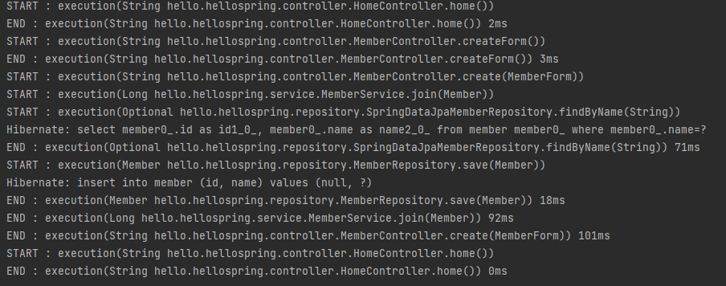

# Spring & Spring Boot

## Spring 이란?
### Spring 핵심 철학
- 스프링은 JAVA 기반의 FrameWork
- 객체지향 프로그래밍이 제공하는 폭넓은 혜택을 누릴 수 있도록, 기본으로 돌아가 오브젝트에 관심을 갖는것을 목표

### Spring 사용 이유
- 단순화된 단위 테스팅
- 복잡한 코드의 감소
- 아키텍처의 유연성

- - -
## Spring 구조
### Spring 주요 모듈 
- 레이어 별로 크게 `Core Container`,`AOP`,`Web`,`Data Acess`, `Test` 로 나눌 수 있다.

#### Core Container
스프링 Core Container 에는 4가지 모듈이 있다.
1. Bean & Core
   - `IoC / DI` 기능의 지원을 담당
   - `Core`는 다른 스프링 모듈에서 필요로 하는 공통 기능을 갖고있는 핵심 모듈. 주요 어노테이션, 컨버터, 상수, 유틸리티 클래스등을 제공.
   - `Beans`는 스프링 DI 기능 기능의 핵심인 Bean Factory와  DI 기능을 제공 하는 모듈
2. Context
   - Beans의 기능을 구현받아 사용하는 Beans의 확장 버전. 해당 모듈을 가장 많이 쓰며, Spring 개발의 필수.
3. spEL
   - 객체 그래프를 조회하고 조작하는 기능을 제공
   > 표현식  
   > '#{"표현식"}' : "표현식"을 실행함    
   > 프로퍼티 참조  
   > ${"프로퍼티"} : "프로퍼티"를 참조할 때 사용.

   
#### AOP
1. AOP
2. Aspect
3. Instrument
4. Test

#### WEB
#### Data Access
#### Test

### DI를 이용한 객체 생성
- DI란?
- 의존성 주입 방법
### Bean 라이프 사이클과 범위
 
 